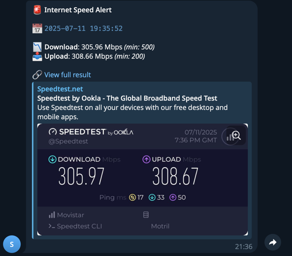

# 📡 speedtest-monitor

A Docker container that monitors your internet connection speed (download and upload) using Ookla’s Speedtest CLI. It runs periodically via cron and alerts you if speeds drop below your desired threshold.

---

## 🚀 Features

- Periodically runs Speedtest CLI (every hour by default)
- Checks download and upload speeds (in Mbps)
- Logs results to stdout (visible via `docker logs`)
- Alerts when speed drops below defined thresholds
- Telegram notifications

---

## 🐳 Usage

### 🚀 Quickstart (Docker run)

#### 🔹 Using Docker Run

Run the container directly from Docker Hub with scheduled checks and environment configuration:

```bash
docker run -d \
  --name speedtest-monitor \
  -e CRON_SCHEDULE="30 * * * *" \
  -e MIN_DOWNLOAD=270 \
  -e MIN_UPLOAD=260 \
  -e TELEGRAM_BOT_TOKEN="" \
  -e TELEGRAM_CHAT_ID="" \
  --restart unless-stopped \
  samuelrb/speedtest-monitor:latest
```

#### 🔹 Using Docker Compose
```bash
docker compose up -d
```

### Build
```bash
docker build -t speedtest-monitor docker
```
### Run simple (without telegram notifications)
```bash
docker run -d --restart=always --name speedtest-monitor samuelrb/speedtest-monitor
```
### Run with options all options (remove unused options)

```bash
docker run -d \
  -e MIN_DOWNLOAD=1000 \
  -e MIN_UPLOAD=1000 \
  -e SERVER_ID=12345 \
  -e TELEGRAM_BOT_TOKEN="1234567:AABCC123_asdfjnnASDF" \
  -e TELEGRAM_CHAT_ID="12345667" \
  -e CRON_SCHEDULE="* * * * *" \
  --restart=always \
  --name speedtest-monitor \
  samuelrb/speedtest-monitor
```

### Output
The container logs output to stdout:

```yaml
2025-04-23 16:14:22 - Result: {"type":"result","ping":{"jitter":0.392,"latency":16.106,"low":15.971,"high":16.716},"download":{"bandwidth":38449715,"bytes":304397280,"elapsed":8002,"latency":{"iqm":33.063,"low":16.268,"high":67.449,"jitter":3.069}},"upload":{"bandwidth":38688161,"bytes":389129091,"elapsed":10314,"latency":{"iqm":51.215,"low":17.163,"high":143.069,"jitter":5.956}},...}
2025-04-23 16:14:22 - Download: 307.59772000000000000000 Mbps, Upload: 309.50528800000000000000 Mbps
2025-04-23 16:14:22 - ⚠️ Warning: low speed (Download: 307.59772000000000000000, Upload: 309.50528800000000000000) threshold (Download: 1000, Upload: 200)
```

View logs with:
```bash
docker logs -f speedtest-monitor
```
### 📣 Telegram Alerts

You can receive speed alerts via Telegram if the measured download or upload speeds fall below the configured thresholds.

To enable this feature, set the environment variables `TELEGRAM_BOT_TOKEN` and `TELEGRAM_CHAT_ID`.

#### 📤 Example Telegram message



> This message is sent when the measured speed is below the configured limits.

> The alert message includes current download/upload speeds and a link to the full Speedtest result.


### ⚙️ Environment Variables

| Variable | Description                            | Default |
|---------|----------------------------------------|------|
| `MIN_DOWNLOAD` | Minimum download speed threshold (Mbps) | 200  |
| `MIN_UPLOAD` | Minimum upload speed threshold (Mbps)  | 200  |
| `SERVER_ID` | Optional Speedtest server ID to use.   | Auto |
| `TELEGRAM_BOT_TOKEN`  | Your Telegram bot's token              | void |
| `TELEGRAM_CHAT_ID`    | Your personal chat ID or group chat ID | void |
| `CRON_SCHEDULE`      | The cron expression to schedule script | 0 * * * * |

Find server IDs by running:
```bash
docker run --rm speedtest-monitor speedtest --servers
```

## ⏰ Cron Schedule
By default, Speedtest runs every hour. You can modify the schedule by editing the crontab.txt:
```bash
# Run every hour
0 * * * * /usr/local/bin/speedtest-check.sh >> /proc/1/fd/1 2>&1
```

## 🔹 Using Host Cron (ephemeral container)
This method allows the container to run only when scheduled by the host system. Ideal for minimizing resource usage.

Create a cron job on your machine (host) with the following line:

```bash
0 * * * * docker run -d --rm \
  -e MIN_DOWNLOAD=270 \
  -e MIN_UPLOAD=260 \
  -e TELEGRAM_BOT_TOKEN="your_bot_token" \
  -e TELEGRAM_CHAT_ID="your_chat_id" \
  samuelrb/speedtest-monitor:latest /usr/local/bin/speedtest-check.sh
```

Save it with `crontab -e`

No `CRON_SCHEDULE` is needed, since the scheduling is external.

This overrides the default CMD and directly executes the check script.

✅ This is the most lightweight approach — Docker runs only during the test, then shuts down.

## 🧪 Tests (Optional)
To validate the container before publishing, you can test the script with:

```bash
docker run --rm speedtest-monitor /usr/local/bin/speedtest-check.sh
```

## 📡 GitHub Actions
This repository includes a GitHub Actions workflow that automatically builds and pushes the Docker image to Docker Hub when changes are merged into the main branch.

Make sure to configure the following GitHub secrets:
- `DOCKER_USERNAME`
- `DOCKER_PASSWORD`


## ❗️Important Legal Note

This project is licensed under the MIT License. However, it relies on the use of the Speedtest CLI provided by Ookla.

The Speedtest CLI is proprietary software with its own [Terms of Use](https://www.speedtest.net/terms), which explicitly restrict certain commercial and automated uses.

**This Docker image is intended for personal and non-commercial use only.** Any commercial usage of the Speedtest CLI must comply with Ookla's licensing terms.

The authors of this project are not affiliated with or endorsed by Ookla.

